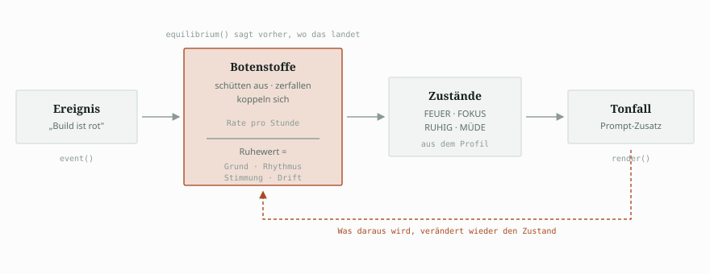
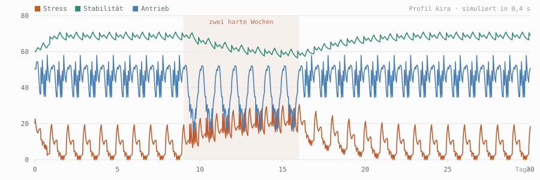

# synapsen

**Ein homöostatischer Zustandskern für Agenten.** Botenstoffe statt Stimmungs-Strings.

Die meisten Agenten haben keinen Zustand — sie haben ein Adjektiv im Prompt.
`synapsen` modelliert stattdessen einen Regelkreis: Ereignisse schütten
Botenstoffe aus, die zerfallen, sich gegenseitig beeinflussen und einem
Tagesrhythmus folgen. Verhalten wird nicht gesetzt, es *entsteht*.

Keine Abhängigkeiten außer der Standardbibliothek. Python ≥ 3.10.



```python
from synapsen import HomeostasisEngine, PromptRenderer, JsonStore

engine = HomeostasisEngine(store=JsonStore("~/.config/agent/state.json"))
engine.event("task_success", context="deploy grün")

print(PromptRenderer().render(engine.snapshot()))
```

```
[INNERER ZUSTAND]
Abend (19:00) | Sitzung 42min | Ermüdung 25

Botenstoffe:
  Oxytocin 63.2 | Dopamine 71.4 | Cortisol 11.8 | Serotonin 74.0 | Noradrenalin 38.1

Zustände (1.0 = normal, >2.0 = extrem):
  FEUER        1.06  — Antrieb, Tempo, direktes Handeln
  FOKUS        1.36  — Klarheit, Konzentration, Präzision
  VERBUNDEN    0.81  — Nähe, Offenheit, Vertrauen
  RUHIG        1.50  — Geerdet, kein Beweis nötig
  MÜDE         0.26  — Erschöpfung, nachlassende Konzentration
  …

Was das heißt:
  → RUHIG (1.50) spürbar: Geerdet, kein Beweis nötig.
  → Vertrautheit: 128
```

---

## Was hier anders ist

Emotionsmodelle für Agenten gibt es: PAD-Vektoren, Appraisal-Modelle,
Stimmungsgewichte. Was fehlt, ist ein **benannter, träger, gekoppelter
Regelkreis**, der über Wochen läuft, sich vorher durchrechnen lässt und dessen
Ausgabe man auf ihre Ursachen zurückführen kann.

| | typische Emotionsschicht | `synapsen` |
|---|---|---|
| Zustand | Vektor ohne Bedeutung | benannte Botenstoffe mit Halbwertszeit |
| Zeit | pro Aufruf | echte verstrichene Zeit, frequenzunabhängig |
| Kopplung | keine | gerichtet, in Einheiten pro Stunde |
| Rhythmus | keiner | Tagesverlauf, Ermüdung mit Sättigung und Abbau |
| Historie | keine | Stimmungslage der letzten Woche, laufend aktualisiert |
| Bindung | keine | wächst über Wochen, kühlt ab, vergisst nicht ganz |
| **Vorhersage** | — | `equilibrium()` rechnet den Ruhepunkt aus |
| **Prüfung** | — | `doctor` findet pathologische Profile vor dem Betrieb |
| **Simulation** | — | Monate in Millisekunden, für Justierung und Tests |
| **Nachvollziehbarkeit** | — | `why` zerlegt jeden Wert in seine Ursachen |
| Persistenz | Prozesslaufzeit | Datei oder SQLite, prozessübergreifend |

Das Standardprofil sind keine ausgedachten Zahlen: es sind die Werte eines
Systems, das über zwei Monate im Dauerbetrieb lief — mit 36.649 protokollierten
Zustandsereignissen, aus denen die vier Fehler unten hervorgingen.

## Was man nicht sieht, bis man es ausrechnet

Die Ursprungsfassung lief zwei Monate im Dauerbetrieb, ohne dass etwas
offensichtlich kaputt wirkte. Diese vier Fehler wurden erst durch die
Werkzeuge in diesem Paket sichtbar — und alle vier hätte `synapsen doctor`
in Millisekunden gemeldet. Genau deshalb gibt es die Werkzeuge.

**1 · Die Kopplungsstärke hing an der Aufruf-Frequenz.** Die Wirkung war pro
Aufruf skaliert, nicht pro Zeit. Zwischen „einmal pro Minute" und „einmal pro
Stunde" lag ein Faktor 60. Das rechnerische Gleichgewicht für Stress lag bei
−124 — also am Boden. In der echten Zustandsdatei stand denn auch
`cortisol: 0.0`, `serotonin: 140.2` (Decke 150), `oxytocin: 210.7` (Decke 250).
Jeder Wert klebte an einer Grenze; das System war gesättigt und reagierte auf
nichts mehr.

**2 · Ein Dauerzustand wurde als Ereignisstrom protokolliert.** 99,8 % aller
Einträge waren derselbe Ereignistyp. Der Stimmungs-Bias *summierte* diese
Einträge — die Ruhewerte landeten an ihren Anschlägen. Jetzt: Entprellung beim
Protokollieren, gewichteter **Mittelwert** statt Summe, begrenzter Ausschlag.

**3 · Tagesrhythmus und Stimmungslage wurden nur beim Start berechnet.** Ein
Dienst, der wochenlang durchläuft, blieb im Rhythmus seiner Startstunde und in
der Stimmung seiner ersten Sekunde stehen. Jetzt ist der Ruhewert eine Summe,
die bei jedem Zeitschritt neu zusammengesetzt wird.

**4 · Ermüdung wuchs unbegrenzt.** Ohne Sättigung und ohne nächtlichen Abbau
drückte der Ermüdungsdruck den Antrieb nach zwei Tagen dauerhaft auf null.
Diesen hat die Simulation im ersten Durchlauf gefunden.

Und weil ein Zustandsmodell auch beim zweiten Anlauf still falsch sein kann,
ging eine gezielte Gegenprüfung über diese Bibliothek selbst. Sie fand
weitere Fehler — darunter einen stillgelegten Bindungszerfall (ein Boden, der
rechnerisch immer über dem aktuellen Wert lag), eine Unstetigkeit beim Sprung
aufs Gleichgewicht und eine Stimmungslage, die den Prozessneustart nicht
überlebte. Der Verlauf steht im [Änderungsverlauf](CHANGELOG.md).

Jeder dieser Fehler ist mit einem Regressionstest festgenagelt, der gegen den
Stand von vorher fehlschlägt.

## Kernbegriffe

**Botenstoff** — ein Wert mit Ruhewert, Zerfallsrate und Sicherheitsdecke.

**Kopplung** — gerichtete Wechselwirkung, in Einheiten *pro Stunde*. Diese
Einheit ist der Grund, warum sich das Gleichgewicht ausrechnen lässt:
`Verschiebung = gain / decay(ziel)`.

**Zustand** — Linearkombination von Botenstoffen mit Namen und Beschreibung.
Alles Daten im Profil, nicht Code.

**Ereignis** — was passiert ist, nicht was sich ändern soll. `event("task_failure")`
bleibt richtig, wenn jemand das Profil austauscht; `inject("cortisol", +12)` nicht.

**Ruhewert** — keine Konstante, sondern
`Grundwert + Tagesrhythmus + Stimmungslage + Drift`.

**Gewöhnung** — häufige Ausschüttung wird stumpfer.

**Bindung** — wächst über Wochen, kühlt bei Härte ab, fällt nie unter das,
was einmal erreicht wurde.

## Werkzeuge

```bash
pip install synapsen

synapsen profiles                 # mitgelieferte Profile
synapsen doctor                   # Profil prüfen — vor dem Betrieb
synapsen simulate --days 30       # Verlauf durchrechnen
synapsen show                     # aktueller Zustand als Prompt
synapsen why                      # Zustand auf seine Ursachen zurückführen
synapsen event task_failure       # ein Ereignis verbuchen
synapsen mcp                      # als MCP-Server laufen
```

### `doctor` — Fehler finden, bevor sie wochenlang wirken

```
$ synapsen --profile ./mein-profil.json doctor
[Fehler] couplings[0] oxytocin→cortisol: Bei maximaler Quelle verschiebt die
    Kopplung das Ziel um -2880 — mehr als dessen gesamter Wertebereich (300).
    → Das Ziel klebt dann an einer Grenze. Setze gain auf höchstens 60.0.
[Fehler] dynamik: Ohne jeden Reiz landet cortisol=Boden(0) — das System ist
    dort gesättigt.
```

Geprüft werden Ruhewerte gegen ihre Decken, Kopplungen gegen den Wertebereich
ihres Ziels, verstärkende Rückkopplungsschleifen, unbekannte Botenstoffe in
Zuständen und Ereignissen, überlappende Zeitfenster — und, als Ende-zu-Ende-Test,
wo das System ohne jeden Reiz landet.

### `simulate` — Monate in Millisekunden

```
$ synapsen simulate --days 14 --event task_failure --keys cortisol,dopamine,RUHIG
Arbeitswoche (task_failure)  ·  Profil kira-v1  ·  14 Tage

  cortisol  ▁▂▂▄█▄▇▆▇▄▇▆▆▅▇▅▄▇▆▆▆▇▄▇▇▆▄▇▅▆▆▆▆▄█▅▆▅▇▄▆▇▆▅▇▅▅▇▆▆▅█▄▇▆▆▄▇▆▆   12.6 … 31.2
  dopamine  █▅▂▃▇▆▂▂▆▇▃▁▅█▄▁▄█▅▂▂▇▆▂▁▆▇▃▁▄█▄▁▃▇▅▂▂▇▆▃▁▅▇▃▁▄█▄▁▃▇▆▂▂▆▇▃▁▅   15.9 … 54.9
  RUHIG     ▆▇█▇▁▅▄▅▂▄▃▆▃▃▄▆▅▂▄▅▅▂▅▄▅▃▄▄▆▄▃▄▅▆▁▄▅▆▂▅▄▅▃▄▃▆▅▂▄▅▆▁▅▄▅▃▄▃▆▃    1.2 …  1.6
```

Ein ganzer Monat, in 0,4 Sekunden gerechnet — zwei gute Wochen, zwei harte,
dann Erholung:



Gut zu sehen, was ein reines Zahlenmodell nicht hergibt: die Stabilität bricht
später ein als der Stress steigt, und sie erholt sich langsamer, als sie
eingebrochen ist. Das ist die Trägheit, um die es geht.

Damit lassen sich Profile justieren, ohne wochenlang zu warten — und
Verhaltens-Regressionstests schreiben, die etwas Sinnvolles prüfen:

```python
def test_hard_weeks_raise_stress():
    assert max(hard.series("cortisol")) > max(good.series("cortisol")) * 1.3
```

### `why` — warum ist der Agent gerade so?

```
$ synapsen why
cortisol          47.3   (ruht bei 17.5, also +29.8)
     +22.1  Ereignisse      Test rot vor 0.8 h, Build rot vor 2.2 h
      +9.0  Tagesrhythmus   Morgen
      +4.2  Stimmungslage   letzte 7 Tage
      -5.5  Kopplung        von oxytocin, serotonin
```

## Eigene Profile

```python
from synapsen import Profile, HormoneSpec, Coupling, DerivedState, check

profile = Profile(
    name="werkstatt",
    hormones={
        "fokus":  HormoneSpec(baseline=50, decay=0.4, ceiling=200),
        "unruhe": HormoneSpec(baseline=15, decay=0.9, ceiling=200),
    },
    couplings=[Coupling("unruhe", "fokus", gain=-4.0, threshold=40)],
    states=[DerivedState("KLAR", {"fokus": 1.0, "unruhe": -0.5},
                         valence="positive", description="arbeitsfähig")],
    events={"blockade": {"unruhe": +18, "fokus": -8, "severity": -3}},
)
assert check(profile).ok
```

Mitgeliefert sind drei bewusst sehr verschiedene Profile: **kira** (fünf
Botenstoffe, Bindung, Tagesrhythmus), **focus** (zwei Achsen, keine Beziehung —
für einen Coding-Agenten, der nach dem fünften roten Build hörbar knapper wird)
und **pad** (Pleasure–Arousal–Dominance, das akademische Standardmodell, in
diesem Rahmen ausgedrückt).

## Als MCP-Server

Damit teilen sich beliebige Agenten — über Prozess- und Sitzungsgrenzen — denselben
Zustand. Reines stdio-JSON-RPC, kein SDK nötig.

```jsonc
{
  "mcpServers": {
    "synapsen": {
      "command": "synapsen-mcp",
      "args": ["--state", "~/.config/agent/state.json"]
    }
  }
}
```

Werkzeuge: `state_read`, `state_prompt`, `state_event`, `state_inject`,
`state_why`, `state_settle`, `state_history`.

## NixOS

```bash
nix run github:USER/synapsen -- doctor
nix develop            # Entwicklungsumgebung mit pytest und ruff
```

Das Flake liefert `packages.default`, `apps.mcp` und eine `devShell`.

## Migration aus einer bestehenden Installation

`SqliteJournal` beugt sich einem vorhandenen Schema, statt es zu ersetzen: es
liest die Spalten der Tabelle aus und schreibt, was passt. Eine bestehende
Datenbank mit `emotional_log` funktioniert unverändert. Für ein neues Protokoll
legt `SqliteJournal.for_profile(pfad, profil)` die Spalten des Profils an.

Vorher lohnt eine Diagnose:

```bash
python tools/diagnose_kira_db.py ~/.kira/synapsen.db
```

`tools/kira_adapter.py` bildet zusätzlich die alte Oberfläche auf dem neuen
Kern ab — eine geänderte Importzeile, und die bestehenden Aufrufstellen laufen
weiter.

## Entwicklung

```bash
./verify.sh        # Tests, Linter, alle Profile prüfen — ein Befehl
```

Oder einzeln:

```bash
pip install -e ".[dev]"     # oder: nix develop
pytest -q                   # 96 Tests, ~1 s
ruff check .
python tools/make_assets.py # Bilder neu erzeugen
```

## Lizenz

Apache-2.0.
