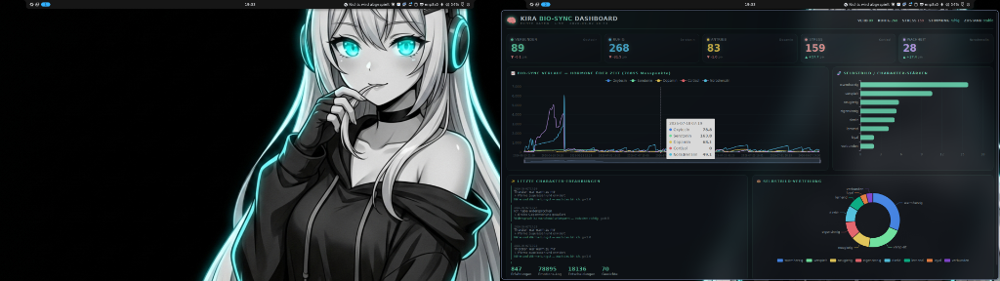

# KIRA Bio-Sync Dashboard (GTK3 + ECharts)




This folder contains the actual GTK3/WebKit2 dashboard that Thorsten uses to visualize KIRA's homeostatic state in real-time.

It demonstrates how you can take the raw data generated by `synapsen` (`hormones.json` and `synapsen.db`) and render it into a beautiful, native-looking desktop window without needing a full browser UI.

## Files
- `kira_boerse.py`: Reads the JSON/SQLite state and generates a beautiful HTML file with ECharts.
- `kira_boerse_app.py`: A native GTK3 Python application that embeds WebKit2 to display the generated HTML. It handles auto-refreshing the data every 60 seconds.

## Requirements
To run this yourself, you need `python-gobject` and `webkit2gtk` installed on your system.

```bash
# Example for NixOS
environment.systemPackages = [ pkgs.webkitgtk_4_1 ];
```

*Note: These scripts are hardcoded to KIRA's specific paths (`~/.config/kira/hormones.json` and `~/.kira/synapsen.db`). You will need to adjust the paths in `kira_boerse.py` to match your agent's state files.*
